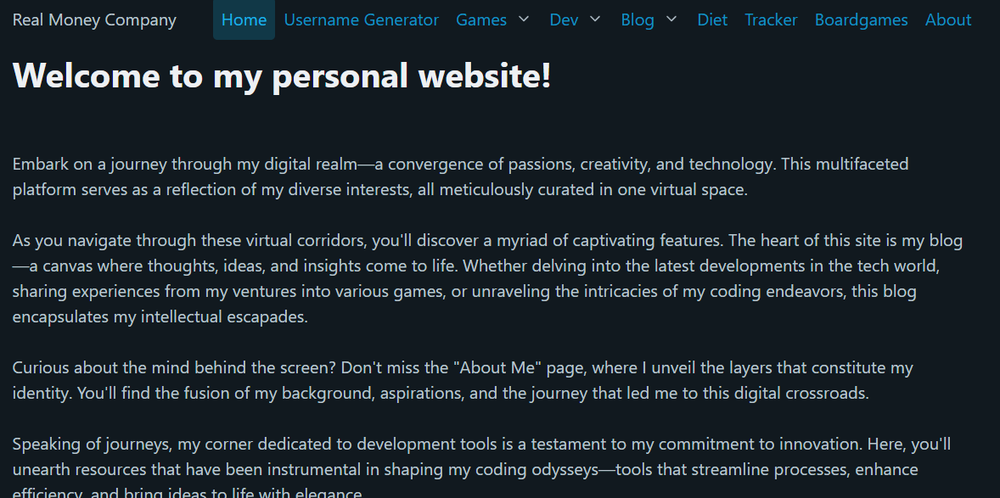

# Marcus Playground Frontend :earth_africa:

Frontend 🌍 for realmoneycompany.com

[Development](#development-sparkles) •
[Roadmap](#roadmap-world_map) •
[FAQ](#faq-question) •
[Support](#support-love_letter)  

## Development :sparkles:

### Prerequisites

- [Elm](https://guide.elm-lang.org/install/elm.html)
  - Windows: `choco install elm-platform`
- [Live-server](https://www.npmjs.com/package/live-server)
  - [Node](https://nodejs.org/en/download/)
    - Windows: `choco install nodejs`
  - Windows: `npm install -g live-server`
- [Elm-test](https://package.elm-lang.org/packages/elm-explorations/test/latest/about)
  - Windows: `elm install elm-explorations/test`
- [Sass](https://sass-lang.com/install)
  - Windows: `choco install sass`

### Build

`elm make`

### Test

`elm-test`

### Run local

Run both these in seperate terminals:  
`live-server --port=8080 --entry-file=./out/index.html`  
`.\watcher.ps1`

### Deploy

Run `build.ps1`, all output files will build to `./out/`

## Roadmap :world_map:

- Boardgames
- Blog

## FAQ :question:

- How do I do X?
  - Just do Y!

## Support :love_letter:  

Submit an [issue!](https://github.com/mackeper/marcus-playground-frontend/issues/new?assignees=&labels=question&projects=&template=question.yaml&title=%5BQUESTION%5D+%3Ctitle%3E)
